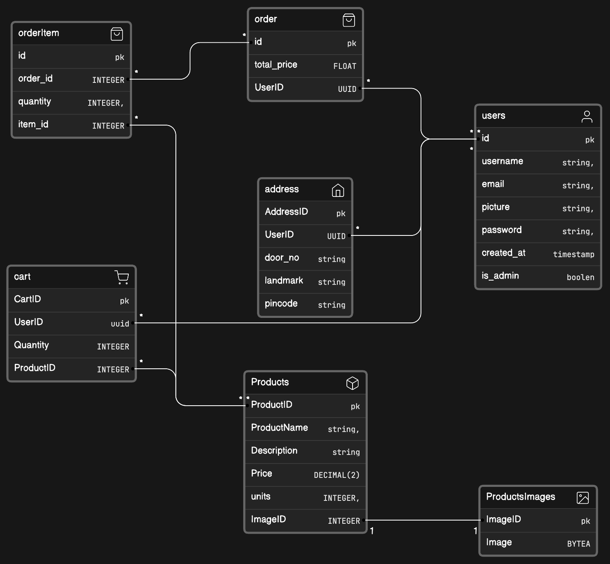

# Ollivanders Store

Ollivanders Store is a wizard-themed e-commerce website where fans of the Harry Potter series can explore and purchase a variety of magical wizard wands.With an intuitive and user-friendly design powered by React and TypeScript for the frontend, complemented by a spellbinding FastAPI backend, Ollivanders Store guarantees a bewitching experience. 

## Project Structure

The project follows a standard structure for a Python web application with a FastAPI backend and a React frontend:

```plaintext
Ollivanders_Store/
|-- backend/
|   |-- app/
|       |-- __init__.py
|       |-- main.py
|       |-- models.py
|       |-- routes/
|       |-- schemas/
|       |-- database.py
|   |-- tests/
|-- frontend/
|   |-- public/
|   |-- src/
|       |-- components/
|       |-- pages/
|       |-- App.tsx
|       |-- index.tsx
|-- .gitignore
|-- README.md
|-- requirements.txt
```

## Backend Design



## Setting Up the Backend

1. Navigate to the `backend` directory.

```bash
cd backend
```

2. Create a virtual environment and activate it.

```bash
python -m venv venv
source venv/bin/activate   # On Windows, use "venv\Scripts\activate"
```

3. Install the required Python packages.

```bash
pip install -r requirements.txt
```

4. Run the FastAPI development server.

```bash
uvicorn app.main:app --reload
```
5. To run the test cases.
   
```bash
pytest
```

The backend should now be running on `http://localhost:8000`.

## Setting Up the Frontend

1. Navigate to the `frontend` directory.

```bash
cd frontend
```

2. Install the required Node.js packages.

```bash
npm install
```

3. Start the React development server.

```bash
npm run dev
```

The frontend should now be accessible on `http://localhost:5173`.

## Accessing the Ollivanders Store

Visit `http://localhost:5173` in your web browser to access the Ollivanders Store and explore the magical wizard wands.
### Working Images


---
